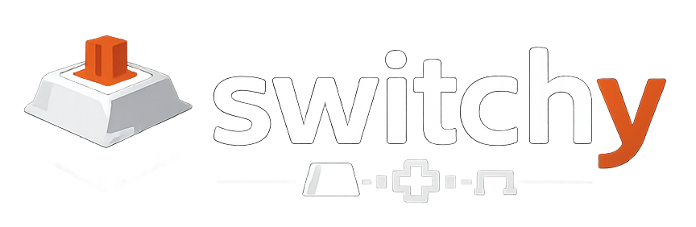

<p align="center">
  
</p>

<h1 align="center">Switchy</h1>

<p align="center">
  <strong>Your AI-powered mechanical keyboard build advisor.</strong><br/>
  Describe the sound and feel you want — get a complete, compatible build with real products and real prices.
</p>

<p align="center">
  <a href="https://switchy-five.vercel.app"><strong>Try the Live App</strong></a> &nbsp;·&nbsp;
  <a href="https://www.youtube.com/watch?v=TKr1wFuRSFM"><strong>Watch the Demo</strong></a>
</p>

<p align="center">
  <em>The video was rushed and doesn't do the app justice — we'd highly recommend trying it yourself.<br/>No sign-in required — Pro access is fully unlocked for everyone, so test as many times as you'd like.</em>
</p>

<p align="center">
  
  
  
  
  
  
</p>

---

## The Problem

The mechanical keyboard hobby has a notoriously steep learning curve. New enthusiasts face a maze of 100+ switch types, incompatible parts, inconsistent vendor inventories, and community jargon ("gasket mount", "POM plate", "thocky") that makes entry daunting. Existing resources are scattered across Reddit threads, Discord servers, and spreadsheets — there's no single place where someone can go from curiosity to a complete, compatible build.

**Switchy turns this fragmented experience into a guided, delightful one.**

## What It Does

Switchy is a full-stack consumer platform where users discover, design, and customize mechanical keyboard builds — with AI doing the heavy lifting of compatibility matching and recommendation.

### Three Paths to a Build

| Path | Who It's For | How It Works |
|------|-------------|--------------|
| **AI Advisor** | Anyone — just describe what you want | Multi-turn chat with Claude. Say "I want something thocky under $200" and get a full parts list with pricing. |
| **Guided Wizard** | Beginners who need structure | 6-step flow: use case → sound preference → budget → size → priorities → AI-generated build |
| **Custom Builder** | Enthusiasts who know what they want | Manual component picker with real-time 3D preview, per-key customization, and undo/redo |

### Interactive 3D Studio

A full Three.js-powered design studio where users visualize their keyboard in real-time — swap case materials, keycap profiles, colorways, lighting, and camera angles. Designs are shareable via URL.

### Product Discovery

Browse **85+ switches**, **105+ keyboards**, **46+ keycap sets**, and **82+ accessories** with advanced filtering by type, sound profile, brand, and price. Side-by-side comparison mode for switches. Every product links to real vendor pages with real pricing.

### Unified Search

A cross-catalog search powered by Nia AI — query across switches, keyboards, keycaps, and external sources simultaneously.

### Group Buy Tracker

The keyboard community runs on group buys — limited-run products that take months to fulfill. Switchy tracks **46+ active group buys** with status timelines, budget management, and a newcomer guide to demystify the process.

### Built-In Education

A searchable **glossary of 80+ terms** with difficulty levels, cross-references, and an AI chatbot — so users learn as they browse.

## Technical Architecture

```
src/
├── app/                    # 22 routes (Next.js App Router)
│   ├── advisor/            # AI multi-turn chat
│   ├── wizard/             # 6-step guided builder
│   ├── builder/            # AI + custom build modes with 3D preview
│   ├── studio/             # 3D keyboard designer
│   ├── search/             # Unified cross-catalog search (Nia AI)
│   ├── switches/           # Explorer + detail + compare
│   ├── keyboards/          # Explorer + detail
│   ├── keycaps/            # Explorer + detail
│   ├── accessories/        # Explorer + detail
│   ├── group-buys/         # Tracker + listings
│   ├── glossary/           # Searchable terms
│   ├── builds/             # Saved builds + public sharing
│   ├── pricing/            # Subscription tiers
│   └── account/            # User profile
├── components/             # 114 components
│   ├── ui/                 # Design system (Card, Badge, Modal, Tabs, Toast...)
│   ├── 3d/                 # Three.js scene, keyboard model, keycap geometry
│   ├── detail/             # Shared product detail (layout, breadcrumb, specs)
│   ├── studio/             # Studio controls, overlays, presets
│   └── builder/            # Build workflow (questions, customizer, pickers)
├── hooks/                  # 10 custom hooks (filters, undo/redo, subscriptions...)
├── lib/                    # Shared types, utilities, constants
└── data/                   # Seed data (85 switches, 105 keyboards, 80+ terms...)

convex/                     # 45 backend files
├── builds.ts               # AI build generation (Claude API)
├── buildAdvisor.ts         # Interactive build advisor
├── stripe.ts               # Payment processing
├── affiliateLinks.ts       # Revenue tracking
├── groupBuyListings.ts     # Group buy management
├── niaSearch.ts            # Nia AI-powered search
├── weeklyDigest.ts         # Automated digest emails
└── ...                     # Auth, CRUD, seeding, webhooks
```

**Why this stack?**

- **Convex** gives us real-time reactivity (live group buy status, instant build saves) without writing a REST API or managing websockets. Queries are just TypeScript functions.
- **Claude Sonnet** powers the advisor and wizard — it understands nuanced preference language ("something between a thock and a clack, not too heavy") and maps it to real product specs.
- **Three.js + R3F** for the studio — the 3D preview makes keyboard design tangible before spending money, which is critical for a $200-500 purchase decision.
- **Clerk** handles auth with zero custom code and integrates natively with Convex via JWT templates.
- **Stripe** for subscriptions with webhook-driven status tracking.

### AI Integration

The AI isn't a chatbot bolted on. It's the core product loop:

1. **Preference understanding** — Claude interprets natural language into structured specs (actuation force, sound profile, budget constraints)
2. **Compatibility matching** — Generated builds use real products from our database, ensuring parts actually work together
3. **Conversation memory** — Multi-turn chat preserves context, so users refine builds iteratively ("make it quieter" / "swap the keycaps for something cheaper")
4. **Usage-metered** — Free tier gets limited generations; Pro unlocks unlimited AI builds + priority generation

### Nia AI — The Knowledge Layer

Nia is the connective tissue between our local product database and the real-time community knowledge that makes Switchy's recommendations trustworthy rather than generic. It's integrated across four critical surfaces:

1. **Build intelligence** — Before Claude generates a build, Nia enriches the AI context with community reviews, Reddit sentiment, and real vendor pricing via universal search. When Switchy says "Gateron Oil Kings are creamy," that's community consensus surfaced through Nia — not a hallucination.
2. **Product validation & fallback** — When the AI recommends a product outside our local DB, Nia's search API acts as the verification layer: confirming the product exists, finding a vendor URL, and extracting live pricing. This is how we guarantee zero hallucinated products in build recommendations.
3. **Cross-catalog search** — The `/search` page runs Nia universal search across all indexed sources simultaneously — local products and external community intel returned in a single query, with 24-hour caching and query deduplication for performance.
4. **Automated weekly intelligence** — Nia Oracle runs as a scheduled cron job that researches new product releases across major vendors, trending community picks from Reddit and YouTube, and group buy status updates. This feeds directly into our weekly digest — the platform gets smarter every week without manual curation.

Without Nia, Switchy would be limited to its static product database. With Nia, it has access to the living, breathing knowledge of the entire mechanical keyboard community — and that's what makes the difference between a recommendation engine and a genuine advisor.

## Monetization

Switchy has **three revenue streams** built into the product:

| Stream | How It Works |
|--------|-------------|
| **Freemium Subscriptions** | Free tier (limited AI builds/month) → Pro tier via Stripe (unlimited builds, priority generation, exclusive presets) |
| **Affiliate Revenue** | Every vendor link in the product is tagged. 200+ affiliate links across 11 product categories track clicks and attribute purchases. |
| **Vendor Sponsorships** | 6 placement types (featured badges, promoted search, build recommendations, homepage spotlights, explorer carousels, deal banners) with impression and click tracking. |

## Retention Mechanics

- **Saved Builds** — Users accumulate builds over time, creating a personal library they return to
- **Group Buy Tracking** — Group buys span months (IC → production → shipping → delivery). Users check back regularly to track status and manage budgets
- **Shareable Links** — Studio designs and builds generate share URLs, driving organic traffic from shared links back to the platform
- **AI Conversation History** — Chat sessions persist, so users pick up where they left off
- **Glossary Progression** — Terms tagged by difficulty (beginner → intermediate → advanced) create a learning arc that grows with the user
- **Budget Management** — Monthly group buy budgets create a recurring reason to check in and plan spending

## Design Philosophy

Switchy is designed to feel premium — matching the craft that keyboard enthusiasts put into their builds:

- **Custom design system** with semantic color tokens, layered shadows, and dark/light mode
- **Anti-generic guardrails** — no default Tailwind palette, no flat shadows, paired display + sans fonts, spring-easing animations
- **Mobile-first responsive** across all 22 routes
- **Real product images only** — zero placeholders, ever
- **3D interaction** as a first-class feature, not a gimmick

## Quick Start

```bash
# Install dependencies
npm install

# Set up Convex
npx convex dev --once --configure=new

# Add environment variables to .env.local
# NEXT_PUBLIC_CLERK_PUBLISHABLE_KEY, CLERK_SECRET_KEY,
# NEXT_PUBLIC_CONVEX_URL

# Add to Convex dashboard: ANTHROPIC_API_KEY, REPLICATE_API_TOKEN

# Start dev server
npm run dev

# Visit /seed to populate the database
```

## Built With

| Layer | Technology |
|-------|-----------|
| Framework | Next.js 16, React 19, TypeScript 5 |
| Styling | Tailwind CSS v4 (PostCSS) |
| Backend | Convex (real-time database + serverless functions) |
| Auth | Clerk (JWT) |
| AI | Anthropic Claude Sonnet |
| 3D | Three.js, React Three Fiber, Drei, Postprocessing |
| Payments | Stripe |
| Search | Nia AI (cross-catalog + external) |
| Image Gen | Replicate |
